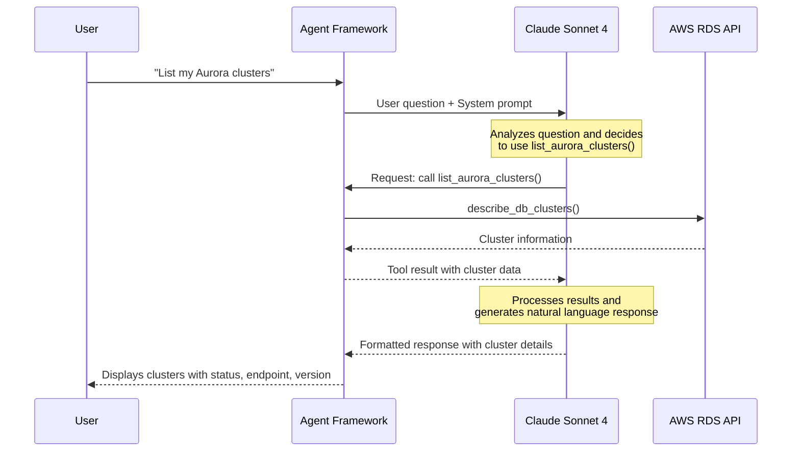

In this module, you'll build your first **database agent** — an AI assistant that can list your database clusters using **Strands Agents**, a code-first framework for building agents.

## What is an AI Agent?

An AI agent combines three parts:

1. **Model**: The reasoning engine (example - Claude Sonnet via Amazon Bedrock)
2. **Tools**: Functions that extend capabilities beyond text generation. In this builder session, you will use tools to query Aurora PostgreSQL cluster and access CloudWatch metrics.
3. **Prompt**: Instructions that guide agent behavior

## Build Your Database Agent

### Step 1: Open the starter file

You'll build the agent step-by-step, adding each core component (model, tool, and prompt).

:::alert{header="Action Required" type="warning"}
In VS Code Server, open file `agent/firstdbagent.py`. Observe placeholders for 1. model, 2. tool, and 3. system prompt.
:::

### Step 2: Add the model

Strands supports many model providers (Amazon Bedrock, OpenAI, Anthropic, Azure OpenAI, or local models), making your agent code portable. Here, we'll use Claude Sonnet 4 via Amazon Bedrock.

:::alert{header="Action Required" type="warning"}
**Replace** `# TODO1: Define the model here` with the following code:
:::

:::code{language=python showLineNumbers=false showCopyAction=true}
model = 'us.anthropic.claude-sonnet-4-20250514-v1:0'
:::

::::expand{header="🔐 Screenshot (click to expand)"}

::::

### Step 3: Add tool

Tools extend the agent's capabilities beyond text generation. You can transform a Python function into a tool by adding the `@tool` decorator. This tells the agent that this function is available for it to call.

:::alert{header="Action Required" type="warning"}
**Replace** `# TODO2: Add database tool here` with the following code:
:::

:::code{language=python showLineNumbers=false showCopyAction=true}
@tool
def list_aurora_clusters() -> str:
    """List all Aurora clusters in the current region."""
    rds = boto3.client('rds',region_name=os.getenv('AWS_REGION'))
    response = rds.describe_db_clusters()
    clusters = response['DBClusters']           
    return clusters
:::

::::expand{header="🔐 Screenshot (click to expand)"}

::::

### Step 4: Add the system prompt

:::alert{header="Action Required" type="warning"}
**Replace** `# TODO3: Add the system prompt here` with the following code:
:::

:::code{language=python showLineNumbers=false showCopyAction=true}
prompt = """You are a database assistant. You can list Aurora clusters. Keep responses simple and helpful."""
:::

::::expand{header="🔐 Screenshot (click to expand)"}

::::

### Step 5: Definition of agent

Final step is to pass prompt, model, and tools to the agent definition. No action needed. This is already pre-built.

### Step 6: Run your agent

:::alert{header="Action Required" type="warning"}
Run the agent in terminal:
:::

:::code{language=bash showLineNumbers=false showCopyAction=true}
python /workshop/agent/firstdbagent.py
:::

:::alert{header="Action Required" type="warning"}
Try asking the agent this question:
:::

:::code{language=bash showLineNumbers=false showCopyAction=true}
List Aurora clusters in the current region
:::

::::expand{header="🔐 Screenshot (click to expand)"}

::::

## What happens when you interact with the agent?

When you ask "List my Aurora clusters", Claude analyzes your question and decides to use the `list_aurora_clusters` tool. The agent framework executes the tool, which queries the AWS RDS API. Claude then receives the data and formats it into a helpful response. This is the power of AI agents - turning complex API calls into simple conversations!

:::alert{header="Action Required" type="warning"}
Back in the terminal, quit the database agent by typing `exit` and press enter:
:::

## Prepare for the next module

In the next module, we'll add more sophisticated database monitoring tools to create a comprehensive health check agent.

:::alert{header="Action Required" type="warning"}
Before moving on, run the following command in terminal. This will drop the indexes created by the agent in the earlier module and reintroduce the CPU spike.
:::

:::code{language=bash showLineNumbers=false showCopyAction=true}
psql -t -c "SELECT 'DROP INDEX IF EXISTS ' || i.indexname || ';' FROM pg_indexes i JOIN pg_class c ON i.indexname = c.relname JOIN pg_index idx ON c.oid = idx.indexrelid WHERE i.tablename = 'employees' AND array_length(idx.indkey, 1) = 1 AND EXISTS (SELECT 1 FROM pg_attribute a WHERE a.attrelid = idx.indrelid AND a.attnum = idx.indkey[0] AND a.attname IN ('email', 'last_name'));SELECT pg_stat_statements_reset();" | psql
:::

::::expand{header="🔐 Screenshot (click to expand)"}

::::

