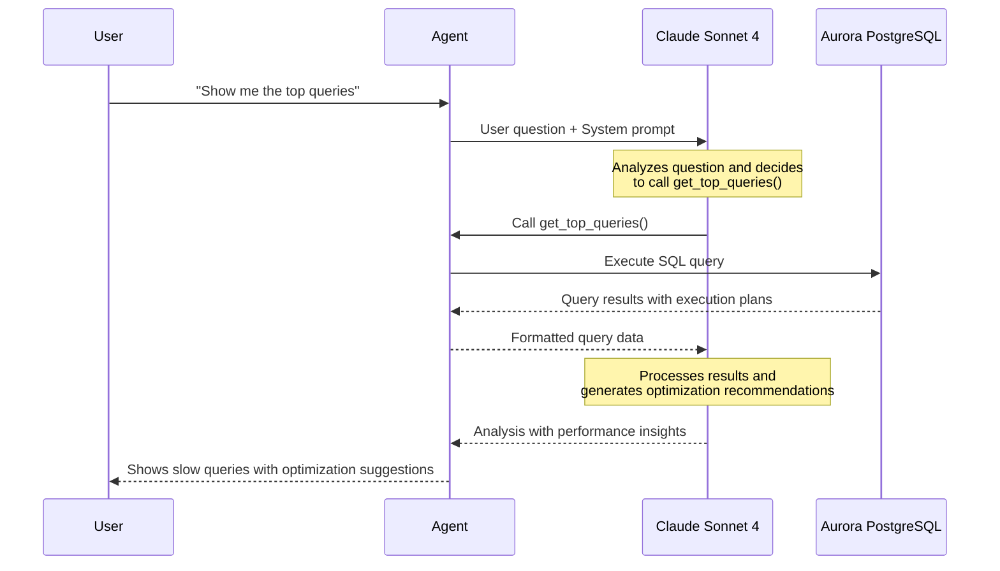

Building on your first database agent, you'll now create a **database health check agent** with multiple tools to analyze your Aurora PostgreSQL database.

Your agent will have these database analysis tools built using standard PostgreSQL monitoring queries:

| Tool | What It Does | PostgreSQL Catalog Used | Status |
|------|--------------|-------------------------|--------|
| `get_largest_tables` | Shows top tables by disk usage | `pg_class`, `pg_namespace` | ✅ Ready |
| `get_unused_indexes` | Finds indexes never used | `pg_stat_user_indexes` | ✅ Ready |
| `get_table_bloat` | Detects tables with dead space | `pg_stat_user_tables` | ✅ Ready |
| `get_index_bloat` | Finds bloated indexes needing maintenance | `pg_stat_user_indexes` | ✅ Ready |
| `get_top_queries` | Shows slow queries with execution plans | `aurora_stat_plans()` | 🔧 **You'll Add This** |

### Step 1: Open the starter file

:::alert{header="Action Required" type="warning"}
In VS Code Server, open file `agent/healthcheck_agent.py`.
:::

::::expand{header="🔐 Screenshot (click to expand)"}

::::

### Step 2: Explore the tools created in this file

Let's look at one of the tools in this file - `get_largest_tables`. Here, we are using a standard PostgreSQL monitoring query to get largest tables in our database inside a python function `get_largest_tables`. Then we are decorating it with `@tool` so that agent can discover and use it depending on context. 

:::alert{header="How to get access to PostgreSQL monitoring SQLs " type="info"}
The standard monitoring SQLs in this file are from [pg-collector](https://github.com/awslabs/pg-collector) which is an open source project.
:::

### Step 3: Navigate to `get_top_queries` function

Similar to `get_largest_tables`, we have other functions in this file with pre-loaded SQLs. **Except - `get_top_queries` which you will add.**

:::alert{header="Action Required" type="warning"}
Search for `get_top_queries` in the file and locate "< TODO : ADD SQL ...>".
:::

### Step 4: Complete the missing tool

:::alert{header="Action Required" type="warning"}
Replace the TODO line with this SQL:
:::

:::code{language=sql showLineNumbers=false showCopyAction=true}
SELECT  
    userid::regrole as user, 
    queryid as queryid,
    datname as DB_name,
    substring(query, 1, 200) AS short_query,
    round(( total_plan_time + total_exec_time )::numeric, 2) AS total_time,
    calls,
    explain_plan
FROM aurora_stat_plans(true) p, pg_database d
WHERE p.dbid=d.oid
ORDER BY total_time DESC
LIMIT 10;
:::

::::expand{header="🔐 Screenshot (click to expand)"}

::::

:::alert{header="What This SQL Does" type="info"}
This query uses `aurora_stat_plans()` to retrieve execution plans and total execution time for each query, then orders by total time to show the most expensive queries first.
:::

### Step 5: Run your health check agent

:::alert{header="Action Required" type="warning"}
Run the health check agent in terminal:
:::

:::code{language=bash showLineNumbers=false showCopyAction=true}
python /workshop/agent/healthcheck_agent.py
:::

### Step 6:  Interactive Database Health Analysis

:::alert{header="Action Required" type="warning"}
Ask the agent this question:
:::

:::code{language=bash showLineNumbers=false showCopyAction=true}
Show me the top queries 
:::

The Health Check agent will use the `get_top_queries` tool you just built to retrieve top queries and examine execution plans to generate recommendations. 

::::expand{header="🔐 Optional review - What happens when you interact with the agent?  (click to expand)"}
Here's the flow when you ask "Show me the top queries":

::::

:::alert{header="Action Required" type="warning"}
Back in the terminal, quit the database agent by typing `exit` and press enter:
:::

### What You've Built

Your health check agent is a comprehensive database optimization tool that analyzes performance through multiple specialized utilities, providing recommendations for improvement. It can display execution plans to help understand query performance bottlenecks, identify cleanup opportunities such as unused indexes that consume unnecessary resources, and detect bloat in both tables and indexes to guide maintenance planning efforts.

### Next Steps

In the next module, we'll create an action agent that can actually implement optimizations safely in production.
