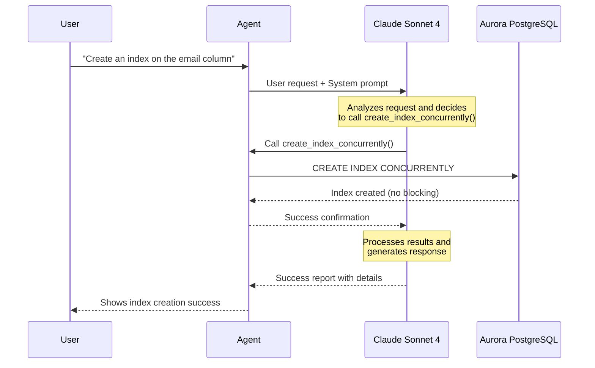

Building on your health monitoring agent, you'll now create a **database action agent** that can implement database optimizations in production without blocking your database.

| Tool | What It Does | PostgreSQL Command Used | Status |
|------|--------------|-------------------------|--------|
| `create_index_concurrently` | Creates indexes without blocking | `CREATE INDEX CONCURRENTLY` | 🔧 **You'll Add This** |
| `analyze_table` | Updates table statistics | `ANALYZE` | ✅ Ready |
| `vacuum_table` | Reclaims space without locks | `VACUUM` (not VACUUM FULL) | ✅ Ready |

### Step 1: Open the starter file

:::alert{header="Action Required" type="warning"}
In VS Code Server, open file `agent/action_agent.py`.
:::

::::expand{header="🔐 Screenshot (click to expand)"}

::::

This file has all tools ready except one - **you'll complete `create_index_concurrently`**.

### Step 2: Complete the missing tool

:::alert{header="Action Required" type="warning"}
Find the `create_index_concurrently` function and replace the TODO with this validation logic:
:::

:::code{language=python showLineNumbers=false showCopyAction=true}
create_sql = f"CREATE INDEX CONCURRENTLY {index_name} ON {table_name} ({column_names})"
:::

::::expand{header="🔐 Screenshot (click to expand)"}

::::

CREATE INDEX CONCURRENTLY benefits:
- Reads and writes continue normally
- No transaction blocking or queuing

### Step 3: Run your action agent

:::alert{header="Action Required" type="warning"}
Run the action agent in terminal:
:::

:::code{language=bash showLineNumbers=false showCopyAction=true}
python /workshop/agent/action_agent.py
:::

:::alert{header="Action Required" type="warning"}
Ask the agent this question:
:::

:::code{language=bash showLineNumbers=false showCopyAction=true}
create index on table projects on field proj_name
:::

::::expand{header="🔐 Optional review - What happens when you interact with the agent?  (click to expand)"}

Here's the flow when you ask "Create an index on the email column":

::::

:::alert{header="Action Required" type="warning"}
Back in the terminal, quit the database agent by typing `exit` and press enter:
:::

## What You've Built

Your action agent can create indexes using CONCURRENTLY to avoid blocking, and perform table maintenance through ANALYZE and VACUUM operations in production environments.

### Next Steps

In the next module, we'll create a supervisor agent that combines your health check and action agents into an autonomous database management system.

This gives you the power of professional database administration with AI intelligence!
