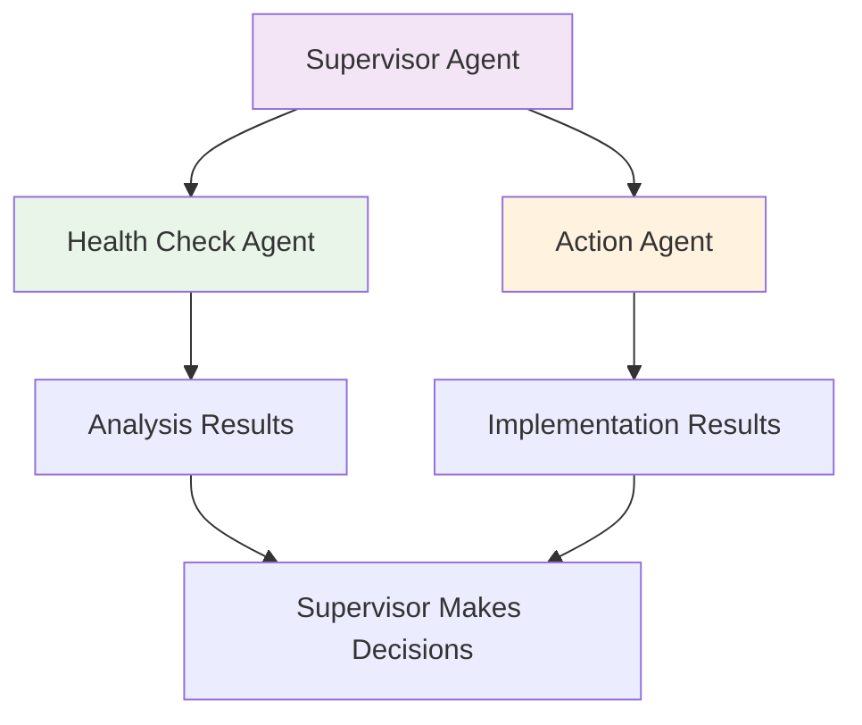
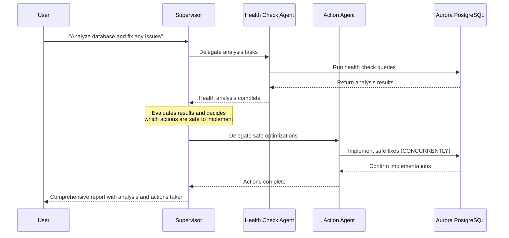

You'll now create the advanced agent - an **autonomous database supervisor** that combines your health check and action agents into a single intelligent coordinator.

The supervisor agent uses **Strands Agent as tools pattern** to coordinate specialized agents. 

Agents as Tools is an architectural pattern in AI systems where specialized AI agents are wrapped as callable functions (tools) that can be used by other agents. This creates a hierarchical structure where :

A primary orchestrator agent handles user interaction and determines which specialized agent to call.
Specialized tool agents perform domain-specific tasks when called by the orchestrator.

Your supervisor combines all the tools from both agents:

| Agent Type | Tools Available | Purpose |
|------------|----------------|---------|
| **Health Check** | `get_largest_tables`, `get_unused_indexes`, `get_table_bloat`, `get_index_bloat`, `get_top_queries` | Database analysis |
| **Action** | `create_index_concurrently`, `analyze_table`, `vacuum_table`| Implement changes |
| **Coordination** | `run_healthcheck()`, `run_action()` | Agent-to-Agent communication |

### Step 1: Open the complete supervisor file

:::alert{header="Action Required" type="warning"}
In VS Code Server, open file `/workshop/agent/supervisor_agent.py`.
:::

This file has the complete autonomous supervisor ready to run.

### Step 2: Explore the supervisor agent

In this agent, we are importing the tools created in previous agents. We'll use the same tools to analyze and implement database performance issues.

### Step 3: Run your autonomous supervisor

:::alert{header="Action Required" type="warning"}
Run the supervisor agent in terminal:
:::

:::code{language=bash showLineNumbers=false showCopyAction=true}
python /workshop/agent/supervisor_agent.py
:::

:::alert{header="Action Required" type="warning"}
Ask the agent this question to do full analysis and implement changes :
:::

:::code{language=bash showLineNumbers=false showCopyAction=true}
Review database activity including top queries and identify root cause of high CPU utilization. Implement fixes one at a time and only ones that will have minimal impact on production.
:::

## What happens with autonomous coordination?

Here's the flow when you ask "Analyze database and fix any issues":

Similar to behavior of the earlier agent, if this agent is working correctly, it should automatically create two critical indexes:
- An index on the **email** field in the **employees** table
- Second index on **last_name** field with operator `text_pattern_ops` to optimize pattern matching queries

:::alert{header="Action Required" type="warning"}
Back in the terminal, quit the database agent by typing `exit` and press enter:
:::

### What You've Built

Your supervisor agent orchestrates multiple specialized agents to provide autonomous database management, combining health analysis and safe production implementations into intelligent workflows that can analyze issues and implement fixes without human intervention.

### Summary

Congratulations! You've built a complete autonomous database management system using AI agents. You now have:

- **Basic Database Agent** - simple cluster monitoring
- **Health Check Agent** - comprehensive database analysis
- **Action Agent** - production-safe optimizations
- **Supervisor Agent** - autonomous coordination and workflows

:::alert{header="Core Modules Complete!" type="success"}
Congratulations! You've completed the core workshop modules. You can now proceed to the [Workshop Summary](/summary/) or continue with the [optional AgentCore deployment module](/5-agentcore-runtime-deployment/) to learn about production deployment patterns.
:::
