In the last module, you used a pre-built agent. In this module, you'll build your own AI agents that can **analyze database health, implement actions, and coordinate complex workflows** through natural language interaction.

### Module Overview

You'll create the following agents in this section. The diagram shows the tools for each agent. The **Supervisor Agent** combines two specialized agents - **Health Check Agent** and **Action Agent** - to coordinate complex workflows.

```mermaid
graph LR
    A[1. First Database Agent<br/>🎯 Basic Concepts]
    B[2. Health Check Agent<br/>📊 Analysis Tools]
    C[3. Action Agent<br/>🔧 Implementation Tools]
    D[4. Supervisor Agent<br/>🤖 Calls Health + Action Tools]
    
    A -.-> E[list_aurora_clusters]
    B -.-> F[get_largest_tables<br/>get_top_queries<br/>get_table_bloat<br/>get_unused_indexes<br/>get_index_bloat]
    C -.-> G[create_index_concurrently<br/>analyze_table<br/>vacuum_table]
    D -.-> H[consult_health_agent<br/>consult_action_agent<br/>Strands Agent as tools Protocol]
    
    style A fill:#e1f5fe
    style B fill:#e8f5e8
    style C fill:#fff3e0
    style D fill:#f3e5f5
```

