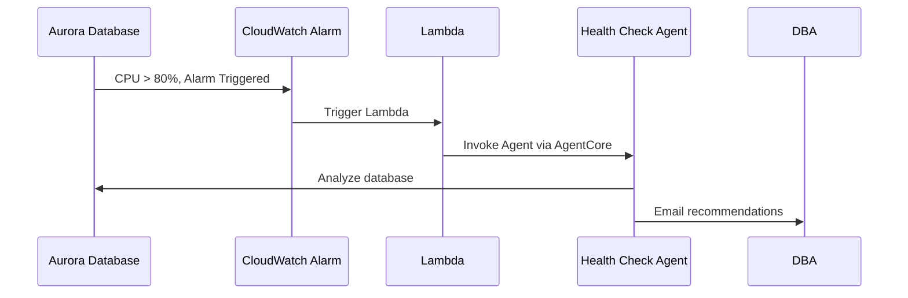

In the previous module, you dropped the indexes to trigger a CPU spike. Now let's verify the automated workflow is functioning correctly.

### Check Alarm State

The CPU spike from the dropped indexes should trigger the CloudWatch alarm in next 2-3 minutes.

:::alert{header="Action Required" type="warning"}
In the terminal, run following command to monitor the alarm state (updates every few seconds):
:::

:::code{language=python showLineNumbers=false showCopyAction=true}
watch -n 2 "echo 'Alarm Status:'; aws cloudwatch describe-alarms --alarm-names dat302-autodbops-labs-aurora-writer-cpu-alarm --query 'MetricAlarms[0].StateValue' --output text; echo '---'; date"
:::

The alarm should transition to **ALARM** state as CPU increases. Once you see **ALARM**, press `Ctrl+C` to stop the watch command. When the alarm transitions to ALARM state, it automatically triggers the Lambda function, which invokes the AgentCore agent.

::::expand{header="🔐 Don't want to wait? Force alarm into ALARM state (click to expand)"}
If you want to force CloudWatch alarm into ALARM state instead of waiting for load generation, run the following command in a new terminal :

:::code{language=python showLineNumbers=false showCopyAction=true}
aws cloudwatch set-alarm-state \
  --alarm-name "dat302-autodbops-labs-aurora-writer-cpu-alarm" \
  --state-value ALARM \
  --state-reason "Manually forcing alarm into ALARM state for testing"
:::

This will change the state immediately. You can confirm it by going back to terminal where you have the `watch` command running.

::::

### Check if Email Has Been Received

If everything is working correctly, the CloudWatch alarm will trigger Lambda, which will invoke the agent running on AgentCore. The agent will then analyze the issue, call appropriate tools to come up with the steps needed to resolve the issue, and finally send an email to you with a recommendation to fix the issue. This email was triggered by the agent deployed on AgentCore using the `send_email_notification` tool. 

The email could take up to 2 minutes to arrive. If you don't see the email in your inbox after 2 minutes, check your spam folder.

:::alert{header="Action Required" type="warning"}
Check your email inbox for a message containing the agent's recommendations. Review the content of the email. It should contain tailored recommendations that you, as a DBA or operator, can review and use to plan actions to address the database issues.
:::

This confirms that the full end-to-end workflow is functioning correctly.

:::alert{header="Why we decided to end with email notification and not implement fixes  automatically?" type="info"}
While earlier modules showed agents can execute database changes, production systems require careful consideration. AI models can occasionally make incorrect decisions, so thorough testing and validation are essential before deploying automated remediation.

This module demonstrates a safer production pattern: agents analyze issues and send actionable recommendations to DBAs via email. This gives you AI-powered insights with human approval before changes are applied, balancing automation benefits with operational safety.
:::

---

### Summary

You've successfully deployed an autonomous database operations workflow using AgentCore. The system monitors Aurora database health through CloudWatch alarms, automatically invokes AI agents when issues are detected, and delivers actionable recommendations via email. This production-ready pattern demonstrates how to leverage AI for database operations while maintaining human oversight for critical decisions.
