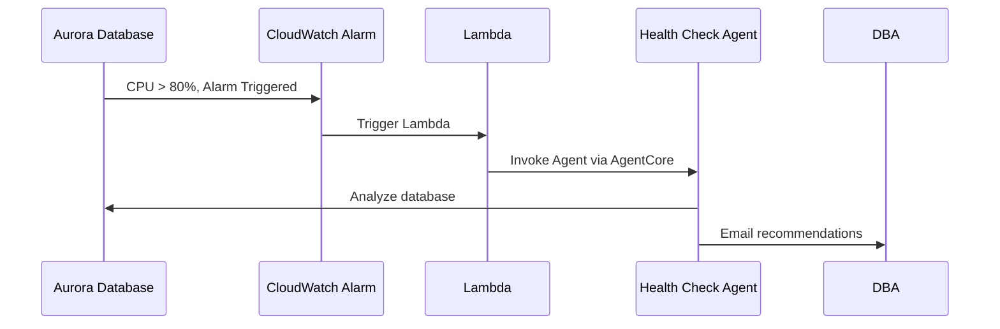

:::alert{header="Optional Module" type="info"}
This module is optional and adds approximately 10 minutes to the workshop. You can complete the core learning objectives without this module. However, it demonstrates production deployment patterns for AI agents.
:::

In the previous module, you built a multi-agent AI system using Strands to perform health checks and remediate a high CPU incident on an Aurora cluster. Up to now, the agent has been running locally on your VS Code server.

In this module, you will take the next step and deploy your agent to Bedrock AgentCore Runtime—a secure, serverless, purpose-built environment for hosting and executing AI agents and tools at scale.

After deploying the agent to AgentCore, you will build automation to invoke the agent automatically when the database is under stress. Here is the end-to-end workflow : 

### Why host on Bedrock AgentCore?

Hosting on Bedrock AgentCore enables automatic agent invocation whenever database metrics breach thresholds. 

Remember the 2 AM scenario? Instead of manually investigating, DBAs now receive tailored AI recommendations automatically. This speeds up resolution, reduces downtime, and helps bring applications back online faster.

:::alert{header="Important Note on Safety and Accuracy" type="info"}
In the previous module, while we have shown that Agentic AI can be used to take actions on a database, LLMs are not always 100% accurate. We recommend experimenting carefully and including robust verification steps before implementing any automation in production.

In this module, we will focus on a practical middle ground: you will learn how to automate notifications to DBAs with tailored recommendations whenever the database is under stress.
:::

Let's begin building our last module in this builder session!
